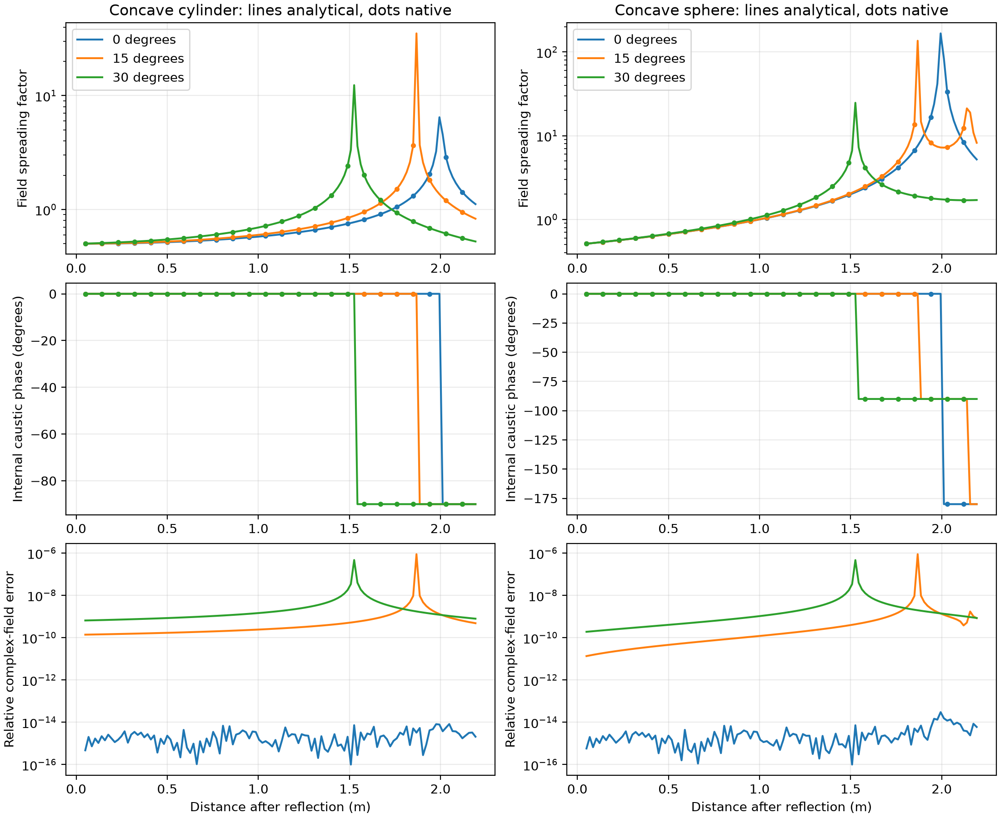
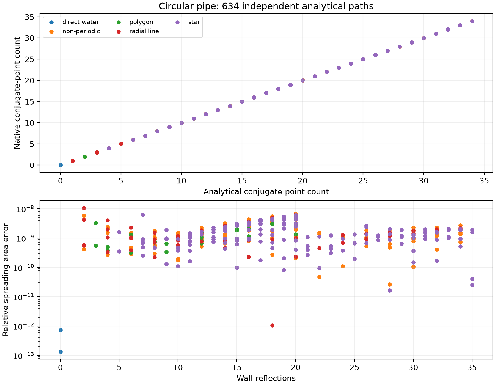

# Internal caustic phase in the native point-ray solver

The native point-ray field previously included geometric spreading, Fresnel
reflection and propagation phase, but omitted the phase accumulated when a ray
bundle crosses an internal focus. This produced quarter-cycle errors in coherent
fields even when path lengths and magnitudes agreed with analytical solutions.

`calculate_spreading` now reports `caustic_count`, counting conjugate points with
multiplicity. `reconstruct_field` multiplies the field by `exp(-i*pi*mu/2)` for
the native `exp(-i*omega*t)` convention. A cylindrical line focus contributes
one; a spherical point focus contributes two. Reflection phase remains in the
Fresnel dyadic. The public Gaussian-beam API already transports continuous Gouy
phase and is unchanged by this correction.

## Geometry and count

The magnitude still comes from independent, adaptively converged central
differences of the receiver-plane ray map. For the phase index, two position
derivatives X and direction derivatives V are transported along the central ray.
Initially X=0 and V is an orthonormal launch tangent basis. On a free segment,
X(s)=X+sV. The transverse determinant is quadratic in s. Its real internal zeros
are counted with their multiplicity, excluding the source and final receiver.
A root at an intermediate reflection belongs to the incoming segment only.

For incoming direction k, geometric normal n, and normal derivative dn, let
dt=-(n^T X)/(n dot k), Q=X+k dt, and k'=k-2(k dot n)n. Reflection gives

```
V' = V - 2 [n (n^T V + k^T dn) + (k dot n) dn]
X' = Q - k' dt
```

The exact normal derivatives are zero for planar primitives and cylinder caps,
(I-n n^T)Q/R for spheres, and (I-axis axis^T-n n^T)Q/R for cylinder sides.
This counts all internal foci, including even numbers that cannot be recovered
from the endpoint determinant sign. Receiver caustics still return `Caustic`
without an isolated-ray amplitude. The count is supported on smooth, nongrazing
specular sequences in a homogeneous medium.

Native HDF5 schema version 3 stores the index with spreading and reconstructed
fields. Version 2 files are explicitly rejected because their stored complex
fields omit this correction; recompute those simulations. The public beam JSON
schema is unchanged.

## Independent analytical checks

`SpreadingBenchmarks.cpp` uses independent single-mirror equations with source
distance a, outgoing distance b, radius R and incidence angle theta:

```
B_t = a + b - 2*a*b/(R*cos(theta))
B_s = a + b - 2*a*b*cos(theta)/R       (sphere)
B_s = a + b                           (cylinder)
g = 1/sqrt(abs(B_t*B_s))
mu = number of negative B values      (one reflection only)
E_z = -g*exp(i*2*pi*(a+b)/lambda - i*pi*mu/2)
```

The sweep uses a=R=2 m, lambda=0.7 m, 120 receiver distances, and incidence
angles 0, 15 and 30 degrees for both shapes. It checks 720 complex fields and
their rigidly transformed caustic counts (1,440 checks). Additional diameter
returns test 1–12 reflections for each shape before and after rigid transforms
(48 checks). The existing spreading and diagnostic suite brings the total to
2,716 checks. CylinderReturnTests also round-trips nonzero counts and corrected
fields through HDF5.

Measured maximum relative complex-field error in the mirror sweep is
8.79e-7. The maximum spreading error over the full suite is 1.86e-6.

`fixtures/circular_pipe.json` contains 634 frozen analytical solutions from the
independent Oil_Pipe `pipe_solver` circular-billiard model, with generating
source SHA-256 hashes. It covers direct, radial, polygon, star and non-periodic
returns, offsets 10 and 30 mm, radius 41.5 mm, and bottom depth 400 mm. Rim paths
are excluded. The 10 mm set allows up to 99 wall reflections; the 30 mm set up
to 20; both are limited to 10 ns. These are fixed oracle values, not values
computed by the native transport under test. Regenerating the oracle requires
the independently maintained Oil_Pipe model; replaying it is self-contained.

`validate_pipe_caustics.py` replays every launch direction and surface sequence
and compares length, spreading and caustic multiplicity. All 634 counts agree;
maximum relative area error is 1.08e-8 and length error is 1.78e-15 m. This
seeded test validates transport, not path-discovery completeness or CST mesh
accuracy. The paper project's additional unseeded same-FFS comparison checks
70 directed returns at 16,000 launches; its maximum relative complex-field
error is 5.38e-7 with no external caustic correction or fitted gain.

## Reproduce and view

Build with `BUILD_TESTING=ON` and `BUILD_BENCHMARKS=ON`, then run:

```powershell
.venv/Scripts/ctest.exe --test-dir build/windows-vcpkg --output-on-failure
build/windows-vcpkg/SpreadingBenchmarks.exe benchmarks/results/caustics
.venv/Scripts/python.exe benchmarks/plot_caustics.py
.venv/Scripts/python.exe benchmarks/validate_pipe_caustics.py
```

Install the rebuilt wheel before the Python replay. Other platforms use the
same targets and scripts with their normal build paths. CSVs, summaries and
PNG/SVG figures are committed in `results/caustics`.




